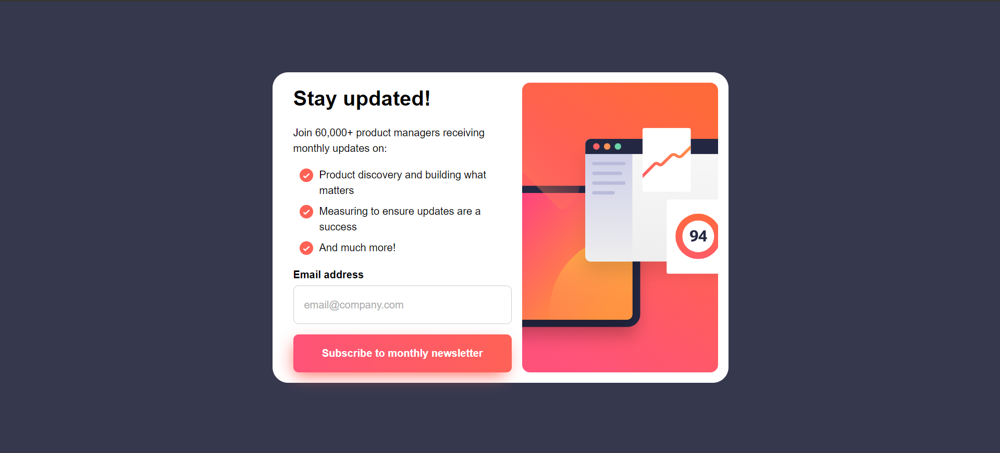

# Frontend Mentor - Newsletter sign-up form with success message solution

This is a solution to the [Newsletter sign-up form with success message challenge on Frontend Mentor](https://www.frontendmentor.io/challenges/newsletter-signup-form-with-success-message-3FC1AZbNrv).

## Table of contents

- [Overview](#overview)
  - [The challenge](#the-challenge)
  - [Screenshot](#screenshot)
  - [Links](#links)
- [My process](#my-process)
  - [Built with](#built-with)
  - [What I learned](#what-i-learned)
  - [Continued development](#continued-development)
  - [Useful resources](#useful-resources)
- [Author](#author)
- [Acknowledgments](#acknowledgments)

## Overview

### The challenge

Users should be able to:

- Add their email and submit the form ✅
- See a success message with their email after successfully submitting the form✅
- See form validation messages if:
  - The field is left empty✅
  - The email address is not formatted correctly✅
- View the optimal layout for the interface depending on their device's screen size✅
- See hover and focus states for all interactive elements on the page✅

### Screenshot



### Links

- Solution URL: [Add solution URL here](https://github.com/Mohammed-Nedjima/newsletter-sign-up-form)
- Live Site URL: [Add live site URL here](https://mohammed-nedjima.github.io/newsletter-sign-up-form/)

## My process

### Built with

- Semantic HTML5 markup
- CSS custom properties
- Flexbox
- CSS Grid
- Mobile-first workflow
- JavaScript

### What I learned

-I learned how to validate html forms using JavaScript and how to store the form data locally on the project directory using:

```js
localStorage.getItem("formData", JSON.stringify(data));
```

-I also learned how to route between pages when clicking on a button using JS with the code below:

```js
location.href = "./sucess.html";
```

## Author

- Frontend Mentor - [@yourusername](https://www.frontendmentor.io/profile/Mohammed-Nedjima)
- Github - [@mohammed-nedjima](https://github.com/Mohammed-Nedjima)

## Acknowledgments

Thanks to the frontend Mentor team for providing such a powerful website to practice your front-end skills and make it to the next level, and for providing the necessary source files for this challenge.
